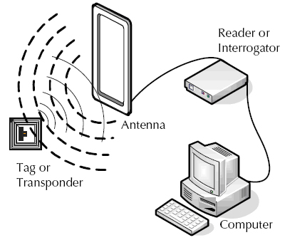

# 3 射频身份识别

**Radio Frequency Identification (RFID)**，即射频身份识别，它通过电磁技术来识别物体上的标签，再将读取到的标签信息发送到后端服务器来检索与该标签对应的其他信息。虽然标签本身不能存储什么信息，但是标签作为一个区分不同物体的唯一标识，在服务器上存储与特定物体相关的信息时与该物体对应的标签关联在一起即可。

下图是RFID的工作原理示意图：

点击查看 [RFID的工作原理及应用](https://en.wikipedia.org/wiki/Radio-frequency_identification) ，可能不少人对RFID的概念很陌生，感觉不到它的存在，但是在生活中确实应用颇广，包括大家使用的银行卡、门禁卡等都是使用了RFID，还有最近比较火的手机NFC也是RFID的一个专用子集。

