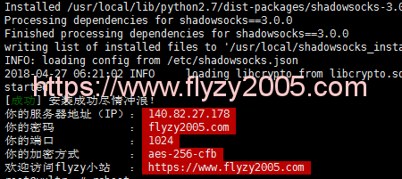

大陆存在非常严重的网络审查、过滤，在大陆上网，必须要掌握科学上网的方法，这是保证能够获取最新互联网资讯、前言计算机技术的必须途径。

这些年各种科学上网的方式也层出不穷，从自由门FreeGate系列软件、Google Agent、红杏、GreenVPN、蓝灯Lantern，这些软件有些还可以继续使用，有的则应被封禁、下架，到现在为止吧，最靠谱的、不容易被审查的方式就是自己购买国外的云主机，然后自建shadowsocks服务器。

这里就有一个自建shadowsocks server并开启google bbr加速的工程 “**ss-fly**“，为了避免被和谐我fork了一份出来，https://github.com/hitzhangjie/ss-fly。

由于之前的教程也已经被和谐掉了，这里我先把教程中的关键内容在这里备忘下吧：

- 下载ss-fly工程，工程中有脚本一键安装shadowsocks server并开启bbr加速：

  ```bash
  git clone https://github.com/flyzy2005/ss-fly
  ```

- 运行脚本ss-fly.sh开始安装、配置shadowsocks server、bbr加速：

  ```bash
  ss-fly/ss-fly.sh -i $password $port
  ```

  成功之后，一般会显示如下信息，提示当前ip、密码、ss监听端口、加密方式等：

  

- 后续希望修改这些配置，比如密码、加密方式等，就可以修改配置文件/etc/shadowsocks/config.json，然后重启：

  ```bash
  ssserver -c /etc/shadowsocks/config.json -d restart
  ```

好，就写这么多，如果安装、配置过程中如有遇到其他问题，请自行检索吧。


shadowsocks server搭建好后，笔记本、手机上还需要安装shadowsocks client，mac下我用的是shadowsocks-ng，收集上我用的是wingy，这两个使用了一段时间，是比较好用的。

shadowsocks-ng使用的时候要注意，它的代理模式、作用包括如下几种：

| Shadowsocks | Mode     | `ss-local`(SOCKS5 Proxy) | PAC Server | macOS System Proxy         |
| ----------- | -------- | ------------------------ | ---------- | -------------------------- |
| On          | PAC Auto | ✔                        | ✔          | Use the PAC file to config |
| On          | Global   | ✔                        | ✘          | Use the SOCKS5 proxy       |
| On          | Manual   | ✔                        | ✘          | No proxy                   |
| Off         | (Any)    | ✘                        | ✘          | No proxy                   |

各种软件的代理配置方式也与此有关，使用的最终计费网络流量也与此有关，我的就是一直开着全局代理看视频，结果10天就花了300人民币，谷歌云是比较靠谱，但是网络流量计费仍然是个大头，要注意，别超标了。