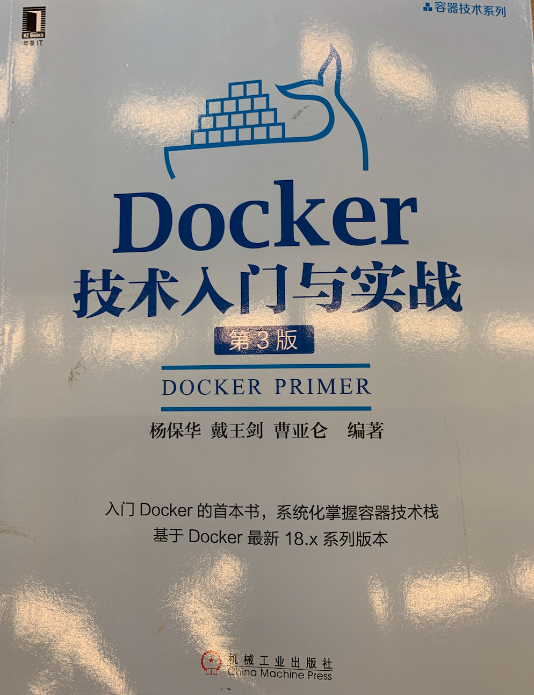

> 这段时间在学习《Docker技术入门与实战》，下面是学习过程中整理的一些知识点。

# 1 初始Docker与容器

> 如果说主机时代比拼的是单个服务器物理处理能力（如CPU主频和内存）的强弱，那么在云时代，最为看重的则是凭借虚拟化技术所构建的集群处理能力。

我们服务性能遇到瓶颈时，可能会选择垂直升级，即升级单物理服务器的处理能力；也可能会水平扩容，即通过增加集群中计算节点的数量来提升服务处理性能。垂直升级是不可能一劳永逸解决问题的，最会有某个时刻请求量超过最大机器负载，支持水平伸缩才是更好的解决问题的方式。

> 伴随着信息技术的飞速发展，虚拟化的概念早已广泛应用到各种关键场景中。从20世纪60年代IBM推出的大型主机虚拟化，到后来以Xen、KVM为代表的虚拟机虚拟化，再到现在以Docker为代表的容器技术，虚拟化技术自身也在不断进行创新和突破。

**虚拟化技术，从60年代以来也在不停地演进，经历了大型主机虚拟化、虚拟机虚拟化、容器技术**。虚拟化可以通过硬件模拟来实现，也可以通过操作系统软件来实现，而容器技术更加优雅，它充分利用了操作系统本身已有的机制和特性，可以实现远超传统虚拟机的轻量级虚拟化。

Docker是基于go语言开发的，该项目已经加入Linux基金会，遵循Apache 2.0协议。Docker的构想是要实现 “**Build, Ship and Run Any App, Anywhere**”。即通过对应用的封装（packaging）、分发（distribution）、部署（deployment）、运行（runtime）生命周期进行管理，达到应用组件级别的“**一次封装，导出运行**”。Docker首次为应用的开发、运行、部署提供了一站式的解决方案。

Docker也是站在巨人的肩膀上诞生的，其中最重要的就是**Linux容器（Linux Containers，LXC）技术**。

>IBM DeveloperWorks对容器技术的描述：
>
>容器有效地将由单个操作系统管理的资源划分到孤立的组中，以更好地在鼓励的组之间平衡有冲突的资源使用需求。

如果我们了解过Linux内核中的cgroups、namespaces，对这段描述的感受会更深，Docker技术就是在其上构建起来的。

**容器技术（包括LXC），也经历了长期的演化：**

- 最早的容器技术可追溯到1982年Unix系列系统上的chroot工具（至今主流Unix、Linux操作系统仍保留着该工具）；
- 早期的容器实现技术有Sun Solaris系统上的Solaris Containers（2004年发布）；
- FreeBSD系统上的jail（2000年左右发布）；
- 以及GNU/Linux上的Linux-VServer（2001年）和OpenVZ（2005年）。

- 在LXC之前，这些相关技术已经成熟、稳定，但是由于种种原因没有集成到主流的Linux内核中，使用起来非常不便，如必须手动打补丁后才能使用。后来LXC取其精华去其糟粕，实现了根据扩展性的虚拟化容器方案，而且被集成到了Linux内核中，成为Linux系统轻量级容器技术的事实标准。
- 在LXC的基础上，Docker进一步优化了容器的使用体验，使其走入了寻常百姓家。如Docker引入了一系列的容器管理工具（如分发、版本、移植等），让用户无需关注底层操作，更加简单明了的管理和使用容器；其次引入了分层文件系统构建以及高效的镜像构建机制，降低了迁移难度，极大改善了用户体验。
- Docker最开始是直接基于LXC的，后来0.9版本开始Docker开发了libcontainer项目作为更广泛的容器驱动实现，从而替换掉了LXC的实现。

> 为什么要使用Docker？Docker项目的发起人Soloman Hykes认为，**Docker在正确的地点、正确的时间顺应了正确的趋势—— 如何正确地构建应用**。
>
> 构建、打包、部署、迁移等等工作，这些琐碎而无趣的“体力活”，极大地降低了用户的开发效率。

究其原因是因为，这些应用直接运行在底层操作系统上，无法保证同一份应用在不同的环境中仍然行为一致。**Docker提供了一种更为聪明的方式，通过容器来打包应用、解耦应用和运行平台**，这意味着迁移的时候，只需要在新的服务器上启动需要的容器就可以了，无论是新旧服务器是否是同一类型的平台。这无疑会节约大量的时间，降低部署过程中出问题的风险。

> Docker容器技术与传统虚拟机技术的比较
>
> | 特性     | 容器               | 虚拟机             |
> | -------- | ------------------ | ------------------ |
> | 启动速度 | 秒级               | 分钟级             |
> | 性能     | 接近原生           | 较弱               |
> | 内存代价 | 很小               | 较多               |
> | 硬盘使用 | 一般为MB           | 一般为GB           |
> | 运行密度 | 单机支持上千个容器 | 单机一般支持几十个 |
> | 隔离性   | 安全隔离           | 完全隔离           |
> | 迁移性   | 优秀               | 一般               |

Docker作为一种轻量级的虚拟化方式，Docker在运行应用上与传统的虚拟机方式相比具有显著的优势。

> 虚拟化（virtualization）技术时一个通用的概念，在不同的领域有不同的理解。在计算领域，一般指的是计算虚拟化（computing virtualization），或通常说的服务器虚拟化。
>
> wikipedia这样定义：**在计算机技术中，虚拟化是一种资源管理技术，是将计算机的各种实体资源，如服务器、网络、内存及存储等，予以抽象、转换后呈现出来，打破实体结构间的不可切割的障碍，使用户可以用比原本的组态更好的方式来应用这些资源。**

虚拟化技术，从大类上可分为：

- 基于硬件的虚拟化

  真正意义上基于硬件的虚拟化技术不多见，少数如网卡中的单根多IO虚拟化（Single Root I/O Virtualization and Sharing Specification，SR-IOV）等技术，超出了本书的讨论范畴。

- 基于软件的虚拟化

  基于软件的虚拟化，根据虚拟化技术服务对象所在的层次，又可以分为 **“应用虚拟化”** 和 **“平台虚拟化”**。

  **应用虚拟化**：如WINE之类的软件，其服务的对象是应用程序，所以属于应用虚拟化。应用虚拟化将**应用程序**与**操作系统**解耦合，为应用程序提供了一个虚拟的运行环境。
  
  **平台虚拟化**：如虚拟机技术、容器技术，其服务的对象是一个平台，如Linux平台，所以属于平台虚拟化。平台虚拟化又可以细分为如下几类。
  
  - **完全虚拟化**：虚拟机管理软件（Type-2 Hypervisor）模拟完整的底层硬件环境和特权指令的执行过程。**客户操作系统无需进行修改**，例如VMware Workstation、VirtualBox、QEMU等。
  
    >全虚拟化是指虚拟机模拟了完整的底层硬件，包括处理器、物理内存、时钟、外设等，使得为原始硬件设计的操作系统或其它系统软件完全不做任何修改就可以在虚拟机中运行。操作系统与真实硬件之间的交互可以看成是通过一个预先规定的硬件接口进行的。全虚拟化 VMM 以完整模拟硬件的方式提供全部接口（同时还必须模拟特权指令的执行过程）。举例而言，x86 体系结构中，对于操作系统切换进程页表的操作，真实硬件通过提供一个特权 CR3 寄存器来实现该接口，操作系统只需执行 "mov pgtable,%%cr3" 汇编指令即可。全虚拟化 VMM 必须完整地模拟该接口执行的全过程。如果硬件不提供虚拟化的特殊支持，那么这个模拟过程将会十分复杂：一般而言，VMM 必须运行在最高优先级来完全控制主机系统，而 Guest OS 需要降级运行，从而不能执行特权操作。当 Guest OS 执行前面的特权汇编指令时，主机系统产生异常（General Protection Exception），执行控制权重新从 Guest OS 转到 VMM 手中。VMM 事先分配一个变量作为影子 CR3 寄存器给 Guest OS，将 pgtable 代表的客户机物理地址（Guest Physical Address）填入影子 CR3 寄存器，然后 VMM 还需要 pgtable 翻译成主机物理地址（Host Physical Address）并填入物理 CR3 寄存器，最后返回到 Guest OS中。随后 VMM 还将处理复杂的 Guest OS 缺页异常（Page Fault）。比较著名的全虚拟化 VMM 有 Microsoft Virtual PC、VMware Workstation、Sun Virtual Box、Parallels Desktop for Mac 和 QEMU。
  
  - **硬件辅助虚拟化**：利用硬件辅助支持（CPU x86体系结构上可用的硬件辅助虚拟化包括Intel-VT和AMD-V）来处理敏感指令实现**“完全虚拟化”**的功能。**客户操作系统无需进行修改**，例如VMware Workstation、Xen、KVM；
  
    >硬件辅助虚拟化是指借助硬件（主要是主机处理器）的支持来实现高效的全虚拟化。例如有了 Intel-VT 技术的支持，Guest OS 和 VMM 的执行环境自动地完全隔离开来，Guest OS 有自己的“全套寄存器”，可以直接运行在最高级别。因此在上面的例子中，Guest OS 能够执行修改页表的汇编指令。Intel-VT 和 AMD-V 是目前 x86 体系结构上可用的两种硬件辅助虚拟化技术。
  
  - **部分虚拟化**：只针对部分硬件资源进行虚拟化。**客户操作系统需要进行修改**，现在有些虚拟化技术的早期版本仅支持部分虚拟化；
  
    >VMM 只模拟部分底层硬件，因此客户机操作系统不做修改是无法在虚拟机中运行的，其它程序可能也需要进行修改。在历史上，部分虚拟化是通往全虚拟化道路上的重要里程碑，最早出现在第一代的分时系统 CTSS 和 IBM M44/44X 实验性的分页系统中。
  
  - **超虚拟化（paravirtualization）**：部分硬件接口以软件的形式提供给客户机操作系统，客户操作系统需要进行修改，调用硬件接口能力实现虚拟化，例如早期的Xen。
  
    > 这是一种修改 Guest OS 部分访问特权状态的代码以便直接与 VMM 交互的技术。在超虚拟化虚拟机中，部分硬件接口以软件的形式提供给客户机操作系统，这可以通过 Hypercall（VMM 提供给 Guest OS 的直接调用，与系统调用类似）的方式来提供。例如，Guest OS 把切换页表的代码修改为调用 Hypercall 来直接完成修改影子 CR3 寄存器和翻译地址的工作。由于不需要产生额外的异常和模拟部分硬件执行流程，超虚拟化可以大幅度提高性能，比较著名的 VMM 有 Denali、Xen。
  
  - 操作系统级虚拟化：内核通过创建多个虚拟的操作系统实例（内核和库）来隔离不同的进程。容器相关技术即在这个范畴内。
  
    > 在传统操作系统中，所有用户的进程本质上是在同一个操作系统的实例中运行，因此内核或应用程序的缺陷可能影响到其它进程。操作系统级虚拟化是一种在服务器操作系统中使用的轻量级的虚拟化技术，内核通过创建多个虚拟的操作系统实例（内核和库）来隔离不同的进程，不同实例中的进程完全不了解对方的存在。比较著名的有 Solaris Container [2]，FreeBSD Jail 和 OpenVZ 等。
  
    **这种分类并不是绝对的，一个优秀的虚拟化软件往往融合了多项技术。**例如 VMware Workstation 是一个著名的全虚拟化的 VMM，但是它使用了一种被称为动态二进制翻译的技术把对特权状态的访问转换成对影子状态的操作，从而避免了低效的 Trap-And-Emulate 的处理方式，这与超虚拟化相似，只不过超虚拟化是静态地修改程序代码。对于超虚拟化而言，如果能利用硬件特性，那么虚拟机的管理将会大大简化，同时还能保持较高的性能。

# 2 核心概念与安装配置

# 3 使用Docker镜像

# 4 操作Docker容器

# 5 访问Docker仓库

# 6 Docker数据管理

# 7 端口映射与容器互联

# 8 使用Dockerfile创建镜像

# 9 操作系统

# 10 为镜像添加SSH服务

# 11 Web服务于应用

# 12 数据库应用

# 13 分布式处理与大数据平台

# 14 编程开发

# 15 容器与云服务

# 16 容器实战思考

# 17 核心实现技术

# 18 配置私有仓库

# 19 安全防护与配置

# 20 高级网络配置

# 21 libnetwork插件化网络功能

# 22 Etcd高可用简直数据库

# 23 Docker三剑客之Machine

# 24 Docker三剑客之Compose

# 25 Docker三剑客之Swarm

# 26 Mesos优秀的集群资源调度平台

# 27 Kubernetes生产机容器集群平台

# 28 其他相关项目

