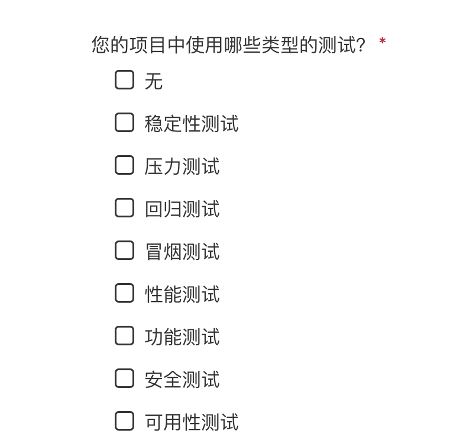

如何做好测试，是一门系统性的方法学，而不只是一些零零散散的经验。

这里的测试方法，落实在我们开发人员身上的，大致包括：

其中落实到开发人员身上的，或者说每一个开发人员应该切实掌握的，我觉得可以包含这几个层面：

-   可用性测试，你要保证自己写出的代码是可测试的，别一运行go test就直接因为写死路径等问题给panic了；
-   功能测试，这个是重中之重，如果连正确性都不能保证，那其他测试也都无从谈起了；
-   压力测试，服务性能也是非常重要的一个非功能性指标，性能好意味着可以支撑更大的请求量级；

这几个我觉得是每位开发首先应该掌握起来的，这里结合go开发，重点说下功能测试。

研发效能要求提升代码库的测试覆盖率，要提高测试的价值，我们得先学些下掌握比较好的测试的方法。

参考了下go测试的一些实践，业务中肯定会遇到如下这些情况，或多或少：
- 新老服务都有比较多的外部依赖，比如网络调用、读db等
- 存量服务维护、开发，有些不适合大范围重构的
- 测试不要侵入业务代码，不能为了测试写太多不相干的东西

gomock+gostub+gomonkey+goconvey，现在go用的比较多的就是这几个，我比较推荐gomock、gomonkey，看情况，灵活组合使用吧，我先总结下这几个，大家可以看看。

- gomock是基于interface的，mockgen生成interface对应的mock桩代码，然后再去写mock代码。
   如果前期没这些interface设计的话，也不方便测试。有的话，看起来也不是特别方便。
- gostub支持对变量、方法、过程进行mock，但是用上它，存量代码的话就要做些调整，对代码有侵入，
   因为它是基于变量去作mock，比如func Hello(...)要改成var Hello=func(...)才能用
- gomonkey也支持对变量、方法、过程进行mock，我现在感觉这个比较好用，简单，对代码无侵入，
   和gostub实现原理不太一样，比如函数，它通过汇编调整跳转地址，这么着对内联函数就支持不到了，就得-gcflags="all=-l"禁用内联
- goconvey主要是用来更好地管理测试用例，可以根据情况用或者不用

这里有几篇文章，感兴趣的可以先看下：
组合灵活使用，gomock+gostub+gomonkey+goconvey：https://www.jianshu.com/p/2f675d5e334e
gomonkey实现原理：https://bouk.co/blog/monkey-patching-in-go/

