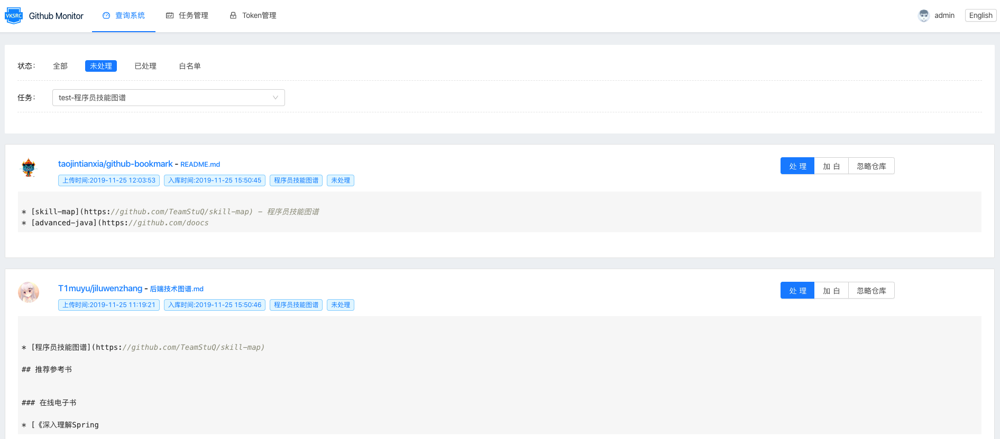

检测Github代码泄漏：https://github.com/VKSRC/Github-Monitor

这个工具体验不错，部署简单、可视化界面操作，大致实现方式就是：

-   可视化配置任务、token；
-   定时监测，不间断监控代码泄漏情况（通过github的api检索指定的关键词）；

-   可视化展示搜索结果，选择将结果列入白名单、标记处理、忽略等等；

-   支持将监控结果以邮件的形式发送到指定邮箱；

    

下面是一个扫描结果的示例：

体验整体感觉不错！

